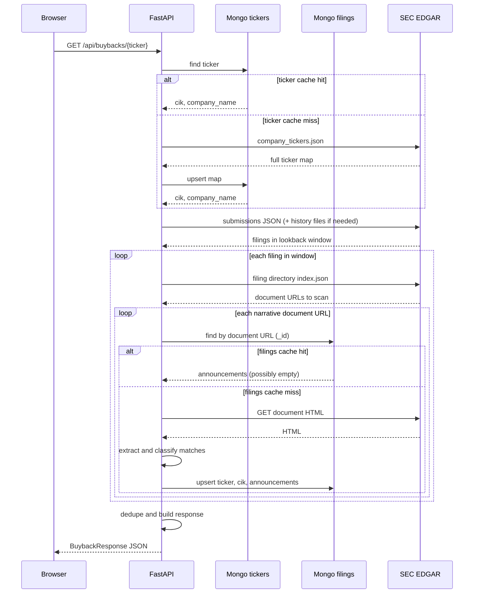

# SEC EDGAR Filings API

A small Python (FastAPI) service (`sec-edgar-filings`) that, given a stock
ticker, finds share buyback / stock repurchase announcements a company has made
to the SEC. The
lookback window defaults to the last 365 days and is configurable up to 5
years.

Given a ticker it:

1. Resolves the ticker to its SEC CIK (cached in MongoDB; see below).
2. Pulls the company's recent `10-K`, `10-Q`, and `8-K` filings from EDGAR.
   For high-volume filers the SEC only inlines roughly the last year of
   submissions, so older filings are pulled from EDGAR's paginated history
   files when the lookback window reaches further back.
3. Keeps only filings filed within the lookback window (365 days by default).
4. Scans every narrative document in each filing -- the primary document *and*
   its exhibits -- for buyback-related phrases. Announcements are frequently
   made in an exhibit (e.g. an earnings press release) rather than the primary
   document. Issuers word these inconsistently ("share" vs "stock" vs "common
   stock", "program" vs "authorization" vs "authority"), so matching is
   deliberately broad and covers variants such as:
   - `... repurchase program` (e.g. "stock repurchase program")
   - `repurchase authorization` / `repurchase authority`
   - `authority to repurchase`, `authorized the repurchase`
   - `stock buyback` / `share buyback` / `buyback program`
5. Each match is classified as a **new authorization** (the filing announces a
   new/expanded buyback) or a **reference** (it merely mentions an existing
   program, e.g. a quarterly execution disclosure).
6. For each match, returns the filing metadata, a context snippet, and a
   best-effort parsed authorization amount.

By default only distinct new authorizations are returned. Pass
`?include_references=true` to also include reference mentions.

Class-share tickers can be written with either a dot or a dash
(`BRK.B` or `BRK-B`); both resolve to the same company.

## Requirements

- Python 3.11+ (developed against 3.13)
- MongoDB (caches ticker → CIK lookups and scanned filing documents). A local
  instance on the default port with no authentication works out of the box.

## Setup

```bash
cd sec-edgar-filings
python3 -m venv .venv
source .venv/bin/activate
pip install -r requirements.txt
```

The SEC requires a descriptive `User-Agent` for all programmatic requests.
Set yours via an environment variable (recommended):

```bash
export SEC_USER_AGENT="Your Name your.email@example.com"
```

If unset, a default placeholder is used, but you should provide a real contact
to avoid being throttled or blocked by the SEC.

### MongoDB

The service uses two collections in the same database. If MongoDB is
unreachable, reads are skipped and writes are no-ops; the API still works by
calling EDGAR directly (just without the cache speed-up).

Defaults point at a local instance; override via environment variables:

```bash
export MONGO_URI="mongodb://localhost:27017"   # add credentials here if needed
export MONGO_DB="sec_edgar_filings"
export MONGO_TICKERS_COLLECTION="tickers"
export MONGO_FILINGS_COLLECTION="filings"
```

#### `tickers` collection — ticker → CIK

Used once per API request to resolve the symbol before any filing work.

| Field | Description |
|-------|-------------|
| `_id` | Upper-case ticker (SEC dash form for class shares, e.g. `BRK-B`) |
| `cik` | Zero-padded 10-digit CIK |
| `company_name` | Issuer name from the SEC ticker map |

- **Cache hit:** ticker is found in Mongo → no `company_tickers.json` download.
- **Cache miss:** fetch the full SEC ticker map from EDGAR, upsert all rows into
  `tickers`, then resolve the requested symbol.
- **Not cached:** unknown tickers (404); the map is not re-fetched on every
  request once populated.

#### `filings` collection — scanned EDGAR documents

Each row is one **narrative document** (primary filing HTML or an exhibit), not
an entire SEC submission. The document’s SEC archives URL is the primary key.
Filings are treated as immutable; corrections arrive as new filings with new
URLs, so scan results are stored indefinitely.

| Field | Description |
|-------|-------------|
| `_id` | Full document URL (e.g. `https://www.sec.gov/Archives/edgar/data/.../ex99.htm`) |
| `ticker` | Request ticker (upper-case), indexed |
| `cik` | Company CIK for that scan, indexed |
| `announcements` | Extracted `BuybackAnnouncement` objects (may be `[]`) |
| `processed_at` | UTC timestamp when the document was last scanned |

Indexes: `ticker`, `cik` (created automatically on first read/write).

- **Cache hit:** document URL exists in `filings` → return stored
  `announcements`; **no** HTML download from EDGAR.
- **Cache miss:** download the document, run phrase extraction and
  classification, then upsert into `filings` (including empty results).
- **Not cached:** transient download errors (network, HTTP errors) — the next
  request will retry EDGAR.
- **Always from EDGAR (even when Mongo is warm):**
  - `submissions/CIK{n}.json` (and paginated history files when `lookback_days`
    reaches beyond the inline “recent” table) — to discover filings in the
    date window and detect **new** submissions since the last visit.
  - `index.json` per filing directory — to list narrative documents (primary +
    exhibits) to scan.

So repeat requests for the same ticker are fast mainly because **document HTML
is not re-fetched**; listing filings from EDGAR is still done to pick up new
8-Ks / 10-Qs.

### Data flow



**When Mongo is used vs skipped**

| Step | Uses Mongo? | Uses EDGAR? |
|------|-------------|-------------|
| Resolve ticker → CIK | Yes (`tickers`), on hit | Only on ticker cache miss |
| List filings in lookback | No | Always |
| List documents in a filing | No | Always (`index.json`) |
| Scan document text | Yes (`filings`), on hit | Only on document cache miss |
| Failed document download | No write to `filings` | Retry on next request |

## Run

```bash
uvicorn app.main:app --port 8080
```

Then:

```bash
curl http://localhost:8080/api/buybacks/ADBE
```

### Query parameters

- `include_references` (bool, default `false`): also return reference/execution
  mentions, not just new authorizations.
- `lookback_days` (int, default `365`, range `1`–`1825`, i.e. up to 5 years):
  how many days back to search for filings. Omit to use the default window.

```bash
# Search only the last 90 days
curl "http://localhost:8080/api/buybacks/ADBE?lookback_days=90"
```

Interactive API docs are available at http://localhost:8080/docs

## Example response

```json
{
  "ticker": "ADBE",
  "cik": "0000796343",
  "company_name": "ADOBE INC.",
  "lookback_days": 365,
  "count": 1,
  "new_authorization_count": 1,
  "reference_count": 4,
  "announcements": [
    {
      "event_type": "new_authorization",
      "announcement_date": "2026-04-21",
      "authorization_date": "2026-04-21",
      "report_date": "2026-04-15",
      "authorization_amount": 25000000000.0,
      "authorization_amount_text": "$25 billion",
      "amount_context": "...Adobe announced that our Board of Directors approved a new stock repurchase program granting Adobe authority to repurchase up to $25 billion in common stock through April 30, 2030...",
      "matched_token": "repurchase program",
      "form": "8-K",
      "filing_date": "2026-04-21",
      "filing_url": "https://www.sec.gov/Archives/edgar/data/796343/000079634326000101/adbe-20260415.htm"
    }
  ]
}
```

`count` is the number of announcements returned; `new_authorization_count` and
`reference_count` report the distinct new authorizations and reference mentions
detected in the window (references are only included in `announcements` when
`include_references=true`).

## Tests

```bash
pytest
```

## Notes

- All narrative documents (primary + exhibits) of each filing are scanned, so
  authorizations announced in an exhibit (common for banks/financials that
  announce via earnings press releases) are detected. The first scan of a ticker
  can issue many EDGAR requests; later scans reuse the `filings` collection and
  mostly avoid re-downloading HTML. Wide `lookback_days` on prolific filers can
  still be slow on the first run.
- `announcement_date` is the board authorization date when one can be parsed
  from the text; otherwise it falls back to the SEC filing date. `report_date`
  (the filing's period of report, e.g. for an 8-K) is included when available.
- Amount parsing is best-effort. `authorization_amount` is `null` when no
  dollar figure can be confidently associated with a match (e.g. for
  references, or programs with no fixed dollar cap such as Berkshire's).
- Buyback phrase matching is intentionally broad to avoid missing real
  announcements; classification then separates genuine new authorizations from
  references. Spot-checking new tickers is recommended.
