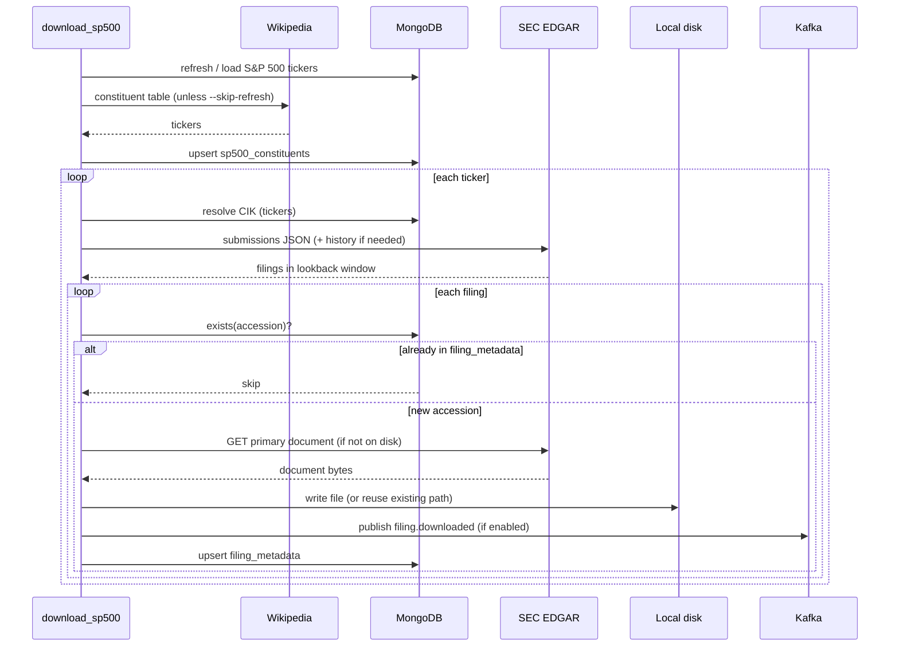

# SEC EDGAR Filings

Python service that downloads recent SEC filings (`10-K`, `10-Q`, `8-K`) from
EDGAR, stores the primary document on local disk, records metadata in MongoDB,
and optionally publishes each newly registered filing to Kafka for downstream
processing (for example, parsing and indexing into a vector database).

The main workload is a batch job that walks the S&P 500 universe. A small
optional FastAPI app exposes stored filing metadata by ticker.

## What it does

1. Resolves tickers to SEC CIKs (cached in MongoDB).
2. Lists recent filings from EDGAR submissions (with paginated history when
   the lookback window reaches beyond the inline “recent” table).
3. Downloads each filing’s **primary document** if it is not already recorded
   in MongoDB.
4. Writes the file to local disk and upserts metadata in the `filing_metadata`
   collection.
5. When Kafka is enabled, publishes an event for every filing newly registered
   in MongoDB (including when the file already existed on disk but metadata was
   missing).

Class-share tickers can be written with either a dot or a dash (`BRK.B` or
`BRK-B`); both resolve to the same company.

## Requirements

- Python 3.11+ (developed against 3.13)
- MongoDB (local instance on the default port works out of the box)
- Kafka (optional; required only when `KAFKA_ENABLED=true`)

## Setup

```bash
cd sec-edgar-filings
python3 -m venv .venv
source .venv/bin/activate
pip install -r requirements.txt
```

The SEC requires a descriptive `User-Agent` on every programmatic request:

```bash
export SEC_USER_AGENT="Your Name your.email@example.com"
```

If unset, a placeholder is used. Provide a real name and contact email to avoid
being throttled or blocked.

## Configuration

All settings are read from environment variables at process start.

### SEC / EDGAR

| Variable | Default | Description |
|----------|---------|-------------|
| `SEC_USER_AGENT` | placeholder | Required by the SEC |
| `SEC_LOOKBACK_DAYS` | `365` | Default filing lookback for single-ticker downloads |
| `SEC_MAX_RPS` | `8` | Max EDGAR requests per second |
| `SEC_TIMEOUT` | `30` | HTTP timeout (seconds) |
| `SEC_MAX_RETRIES` | `3` | Retries on transient failures |
| `EDGAR_DOWNLOAD_BASE` | `/Volumes/Transcend/edgar` | Root directory for downloaded files |

### MongoDB

| Variable | Default | Description |
|----------|---------|-------------|
| `MONGO_URI` | `mongodb://localhost:27017` | Connection string |
| `MONGO_DB` | `sec_edgar_filings` | Database name |
| `MONGO_TIMEOUT_MS` | `2000` | Server selection timeout |
| `MONGO_TICKERS_COLLECTION` | `tickers` | Ticker → CIK cache |
| `MONGO_FILING_METADATA_COLLECTION` | `filing_metadata` | Downloaded filing metadata |
| `MONGO_SP500_COLLECTION` | `sp500_constituents` | S&P 500 universe and job state |
| `MONGO_FILINGS_COLLECTION` | `filings` | Legacy scan cache (buyback analysis) |

If MongoDB is unreachable, reads are skipped and writes are no-ops where
possible; batch jobs continue but without persistence.

### Kafka

| Variable | Default | Description |
|----------|---------|-------------|
| `KAFKA_ENABLED` | `false` | Set to `true` to publish filing events |
| `KAFKA_BOOTSTRAP_SERVERS` | `localhost:9092` | Broker list |
| `KAFKA_FILING_DOWNLOADED_TOPIC` | `filings` | Topic for filing metadata events |

Publishing is best-effort: a broker failure is logged and the MongoDB upsert
still proceeds (non-transactional saga). With `auto.create.topics.enable=true`
on the broker, the topic is created on first publish.

### Batch jobs

| Variable | Default | Description |
|----------|---------|-------------|
| `SP500_DOWNLOAD_LOOKBACK_DAYS` | `30` | Default lookback in backfill mode |
| `SP500_INCREMENTAL_LOOKBACK_DAYS` | `14` | Minimum window in incremental mode |
| `SP500_BACKFILL_LOOKBACK_DAYS` | `SEC_LOOKBACK_DAYS` | Max backfill window |
| `TICKER_RATE_LIMIT_SECONDS` | `60` | Pause between tickers in batch jobs |

On startup, jobs and the API log configured endpoints (SEC, MongoDB, Kafka,
local disk path, S&P 500 source URL).

## On-disk layout

Each filing is stored as:

```text
{EDGAR_DOWNLOAD_BASE}/{TICKER}/{accession_no_dashes}/{primary_document}
```

Example:

```text
/Volumes/Transcend/edgar/GS/000088698226000045/gs-20260515.htm
```

## MongoDB collections

### `tickers` — ticker → CIK

| Field | Description |
|-------|-------------|
| `_id` | Upper-case ticker |
| `cik` | Zero-padded 10-digit CIK |
| `company_name` | Issuer name from the SEC ticker map |

### `filing_metadata` — downloaded filings

Keyed by accession number. One row per downloaded primary document.

| Field | Description |
|-------|-------------|
| `_id` | Accession number (e.g. `0000886982-26-000045`) |
| `ticker` | Upper-case ticker |
| `company_name` | Issuer name |
| `filing_date` | SEC filing date |
| `form` | `10-K`, `10-Q`, or `8-K` |
| `accession_number` | Same as `_id` |
| `local_path` | Absolute path to the file on disk |
| `document_url` | SEC archives URL |
| `downloaded_at` | UTC timestamp when metadata was recorded |

A filing is skipped when its accession number already exists in this collection.

### `sp500_constituents` — S&P 500 universe

Stores active constituents and per-ticker download job state (`last_download_at`,
`last_download_status`, counts, errors).

## Kafka events

Published when a filing is **newly registered** in `filing_metadata` (before the
MongoDB upsert). Message key: `accession_number`. Message value (JSON):

```json
{
  "event_type": "filing.downloaded",
  "schema_version": 1,
  "ticker": "GS",
  "company_name": "GOLDMAN SACHS GROUP INC",
  "filing_date": "2026-05-15",
  "form": "10-Q",
  "accession_number": "0000886982-26-000045",
  "local_path": "/Volumes/Transcend/edgar/GS/000088698226000045/gs-20260515.htm",
  "document_url": "https://www.sec.gov/Archives/edgar/data/...",
  "downloaded_at": "2026-06-16T17:19:53.857546Z"
}
```

Successful publishes are logged with topic, partition, offset, ticker, and
`local_path`.

## Batch jobs

### Refresh S&P 500 universe

Fetches the current constituent list from Wikipedia and upserts MongoDB:

```bash
python -m app.jobs.refresh_sp500
```

### Download filings for S&P 500

Refreshes the universe (unless `--skip-refresh`), then downloads recent filings
for each active ticker:

```bash
# Default: backfill mode, 30-day lookback per ticker
python -m app.jobs.download_sp500

# With Kafka publishing
KAFKA_ENABLED=true python -m app.jobs.download_sp500

# Incremental mode (widens window since last successful download per ticker)
python -m app.jobs.download_sp500 --mode incremental

# Resume after a failure
python -m app.jobs.download_sp500 --skip-refresh --resume-from MSFT

# Override lookback for every ticker
python -m app.jobs.download_sp500 --lookback-days 90

# Debug logging
python -m app.jobs.download_sp500 -v
```

The job prints a JSON summary (`Sp500DownloadResult`) when it finishes.

### Data flow



## API (optional)

The API serves metadata already stored by the download jobs. It does not fetch
from EDGAR on request.

```bash
uvicorn app.main:app --port 8080
```

```bash
curl http://localhost:8080/health
curl http://localhost:8080/api/filings/GS
```

Interactive docs: http://localhost:8080/docs

### Example response

```json
{
  "ticker": "GS",
  "company_name": "GOLDMAN SACHS GROUP INC",
  "count": 1,
  "filings": [
    {
      "ticker": "GS",
      "company_name": "GOLDMAN SACHS GROUP INC",
      "filing_date": "2026-05-15",
      "form": "10-Q",
      "accession_number": "0000886982-26-000045",
      "local_path": "/Volumes/Transcend/edgar/GS/000088698226000045/gs-20260515.htm",
      "document_url": "https://www.sec.gov/Archives/edgar/data/886982/000088698226000045/gs-20260515.htm",
      "downloaded_at": "2026-06-16T17:19:53.857546Z"
    }
  ]
}
```

Returns `404` when no metadata exists for the ticker.

## Tests

```bash
pytest
```

## Notes

- Only the **primary document** per filing is downloaded, not exhibits.
- Clearing `filing_metadata` without deleting on-disk files will re-register
  metadata and republish Kafka events on the next job run (files are reused).
- Kafka publishing requires `KAFKA_ENABLED=true` on the process that runs the
  download job (or API lifespan, if you use the API with Kafka enabled).
- The `app/scan` and `app/analysis` packages contain buyback-phrase extraction
  code used by an older scan path; they are not exposed by the current API.
