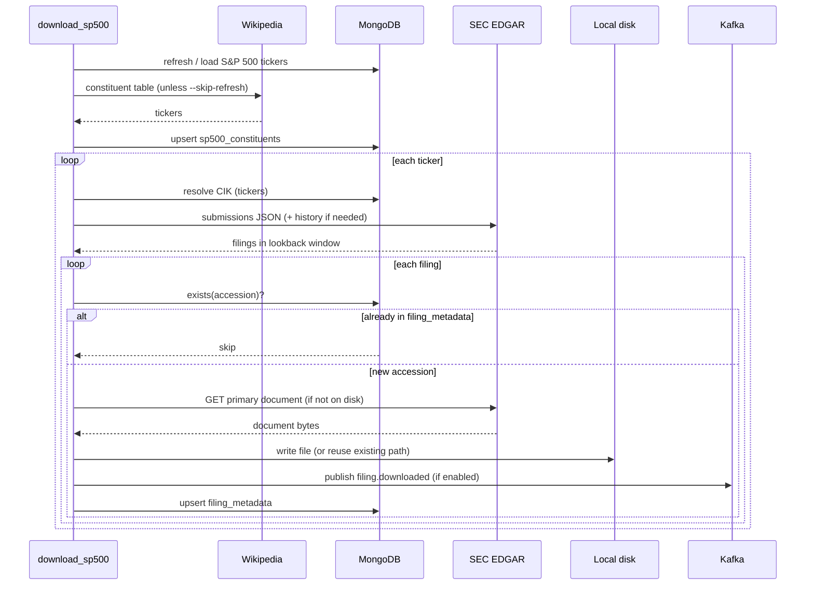

# SEC EDGAR Filings

Python service that downloads recent SEC filings (`10-K`, `10-Q`, `8-K`) from
EDGAR, stores the primary document on local disk, records metadata in MongoDB,
and optionally publishes each newly registered filing to Kafka for downstream
processing (for example, parsing and indexing into a vector database).

The main workload is a batch job that walks the S&P 500 universe. A FastAPI
app serves a small web UI and read-only APIs for inspecting stored data.

## What it does

1. Resolves tickers to SEC CIKs (cached in MongoDB).
2. Lists recent filings from EDGAR submissions (with paginated history when
   the lookback window reaches beyond the inline “recent” table).
3. Downloads each filing’s **primary document** if it is not already recorded
   in MongoDB.
4. Writes the file to local disk and upserts metadata in the `filing_metadata`
   collection.
5. When Kafka is enabled, publishes an event for every filing newly registered
   in MongoDB (including when the file already existed on disk but metadata was
   missing).

Class-share tickers can be written with either a dot or a dash (`BRK.B` or
`BRK-B`); both resolve to the same company.

## Requirements

- Python 3.11+ (developed against 3.13), **or** Docker Desktop / Docker Engine
  with Compose v2
- MongoDB (local instance on the default port works out of the box)
- Kafka (optional; required only when `KAFKA_ENABLED=true`)

## Setup

```bash
cd sec-edgar-filings
python3 -m venv .venv
source .venv/bin/activate
pip install -r requirements.txt
```

The SEC requires a descriptive `User-Agent` on every programmatic request:

```bash
export SEC_USER_AGENT="Your Name your.email@example.com"
```

If unset, a placeholder is used. Provide a real name and contact email to avoid
being throttled or blocked.

## Docker

The app, MongoDB, and Kafka can run in Docker. Downloaded filings are still written
to your **local external drive** via a bind mount — not inside the container
filesystem.

### Prerequisites

- Docker Desktop (or Docker Engine + Compose v2)
- Transcend drive mounted at `/Volumes/Transcend`
- On macOS: enable file sharing for `/Volumes` in Docker Desktop
  (Settings → Resources → File sharing)

### Quick start

```bash
cp .env.example .env
# Edit .env — set SEC_USER_AGENT to your real name + email

export EDGAR_HOST_PATH=/Volumes/Transcend/edgar
export MONGO_HOST_PATH=/Volumes/Transcend/mongo-data
export KAFKA_HOST_PATH=/Volumes/Transcend/kafka-data

docker compose up -d
curl http://localhost:8080/health
# Admin UI: http://localhost:8080/   Browse UI: http://localhost:8080/browse
```

`EDGAR_HOST_PATH` is the folder on your Mac that Compose bind-mounts into
containers. The mount target inside the container is the same path
(`/Volumes/Transcend/edgar`) so `local_path` values in MongoDB and Kafka stay
consistent with files on disk.

MongoDB and Kafka data are also stored on the Transcend drive via bind mounts
(`MONGO_HOST_PATH`, `KAFKA_HOST_PATH`). Create those directories before the
first `docker compose up` if they do not exist yet.

### Services

| Service | Port | Description |
|---------|------|-------------|
| `api` | 8080 | FastAPI app (Admin UI, Browse UI, REST API) |
| `mongo` | 27017 | MongoDB (data on `MONGO_HOST_PATH`, default `/Volumes/Transcend/mongo-data`) |
| `kafka` | 9092 | Kafka broker (KRaft; data on `KAFKA_HOST_PATH`, default `/Volumes/Transcend/kafka-data`) |

Inside the stack, the app connects to `mongodb://mongo:27017` and
`kafka:9092`. Kafka publishing is enabled by default in Compose
(`KAFKA_ENABLED=true`).

### Batch jobs

One-off job containers use the `jobs` profile:

```bash
export EDGAR_HOST_PATH=/Volumes/Transcend/edgar
export MONGO_HOST_PATH=/Volumes/Transcend/mongo-data
export KAFKA_HOST_PATH=/Volumes/Transcend/kafka-data

docker compose --profile jobs run --rm refresh-sp500
docker compose --profile jobs run --rm download-sp500

# Pass job flags after the service name
docker compose --profile jobs run --rm download-sp500 -- --lookback-days 90 -v
```

### Stop and rebuild

```bash
docker compose down          # stop services; data kept on Transcend bind mounts
docker compose build api     # rebuild after code changes
docker compose up -d --build # rebuild and restart
```

## Configuration

All settings are read from environment variables at process start.

### SEC / EDGAR

| Variable | Default | Description |
|----------|---------|-------------|
| `SEC_USER_AGENT` | placeholder | Required by the SEC |
| `SEC_LOOKBACK_DAYS` | `365` | Default filing lookback for single-ticker downloads |
| `SEC_MAX_RPS` | `8` | Max EDGAR requests per second |
| `SEC_TIMEOUT` | `30` | HTTP timeout (seconds) |
| `SEC_MAX_RETRIES` | `3` | Retries on transient failures |
| `EDGAR_DOWNLOAD_BASE` | `/Volumes/Transcend/edgar` | Root directory for downloaded files |
| `EDGAR_HOST_PATH` | `/Volumes/Transcend/edgar` | Host path for the Docker bind mount (Compose only) |
| `MONGO_HOST_PATH` | `/Volumes/Transcend/mongo-data` | Host path for MongoDB data (Compose only) |
| `KAFKA_HOST_PATH` | `/Volumes/Transcend/kafka-data` | Host path for Kafka data (Compose only) |

### MongoDB

| Variable | Default | Description |
|----------|---------|-------------|
| `MONGO_URI` | `mongodb://localhost:27017` | Connection string |
| `MONGO_DB` | `sec_edgar_filings` | Database name |
| `MONGO_TIMEOUT_MS` | `2000` | Server selection timeout |
| `MONGO_TICKERS_COLLECTION` | `tickers` | Ticker → CIK cache |
| `MONGO_FILING_METADATA_COLLECTION` | `filing_metadata` | Downloaded filing metadata |
| `MONGO_SP500_COLLECTION` | `sp500_constituents` | S&P 500 universe and job state |
| `MONGO_FILINGS_COLLECTION` | `filings` | Legacy scan cache (buyback analysis) |

If MongoDB is unreachable, reads are skipped and writes are no-ops where
possible; batch jobs continue but without persistence.

### Kafka

| Variable | Default | Description |
|----------|---------|-------------|
| `KAFKA_ENABLED` | `false` | Set to `true` to publish filing events |
| `KAFKA_BOOTSTRAP_SERVERS` | `localhost:9092` | Broker list |
| `KAFKA_FILING_DOWNLOADED_TOPIC` | `filings` | Topic for filing metadata events |

Publishing is best-effort: a broker failure is logged and the MongoDB upsert
still proceeds (non-transactional saga). With `auto.create.topics.enable=true`
on the broker, the topic is created on first publish.

### Batch jobs

| Variable | Default | Description |
|----------|---------|-------------|
| `SP500_DOWNLOAD_LOOKBACK_DAYS` | `30` | Default lookback in backfill mode |
| `SP500_INCREMENTAL_LOOKBACK_DAYS` | `14` | Minimum window in incremental mode |
| `SP500_BACKFILL_LOOKBACK_DAYS` | `SEC_LOOKBACK_DAYS` | Max backfill window |
| `TICKER_RATE_LIMIT_SECONDS` | `60` | Pause between tickers in batch jobs |

On startup, jobs and the API log configured endpoints (SEC, MongoDB, Kafka,
local disk path, S&P 500 source URL).

## On-disk layout

Each filing is stored as:

```text
{EDGAR_DOWNLOAD_BASE}/{TICKER}/{accession_no_dashes}/{primary_document}
```

Example:

```text
/Volumes/Transcend/edgar/GS/000088698226000045/gs-20260515.htm
```

## MongoDB collections

### `tickers` — ticker → CIK

| Field | Description |
|-------|-------------|
| `_id` | Upper-case ticker |
| `cik` | Zero-padded 10-digit CIK |
| `company_name` | Issuer name from the SEC ticker map |

### `filing_metadata` — downloaded filings

Keyed by accession number. One row per downloaded primary document.

| Field | Description |
|-------|-------------|
| `_id` | Accession number (e.g. `0000886982-26-000045`) |
| `ticker` | Upper-case ticker |
| `company_name` | Issuer name |
| `filing_date` | SEC filing date |
| `form` | `10-K`, `10-Q`, or `8-K` |
| `accession_number` | Same as `_id` |
| `local_path` | Absolute path to the file on disk |
| `document_url` | SEC archives URL |
| `downloaded_at` | UTC timestamp when metadata was recorded |

A filing is skipped when its accession number already exists in this collection.

### `sp500_constituents` — S&P 500 universe

Stores active constituents and per-ticker download job state (`last_download_at`,
`last_download_status`, counts, errors).

## Kafka events

Published when a filing is **newly registered** in `filing_metadata` (before the
MongoDB upsert). Message key: `accession_number`. Message value (JSON):

```json
{
  "event_type": "filing.downloaded",
  "schema_version": 1,
  "ticker": "GS",
  "company_name": "GOLDMAN SACHS GROUP INC",
  "filing_date": "2026-05-15",
  "form": "10-Q",
  "accession_number": "0000886982-26-000045",
  "local_path": "/Volumes/Transcend/edgar/GS/000088698226000045/gs-20260515.htm",
  "document_url": "https://www.sec.gov/Archives/edgar/data/...",
  "downloaded_at": "2026-06-16T17:19:53.857546Z"
}
```

Successful publishes are logged with topic, partition, offset, ticker, and
`local_path`.

## Batch jobs

### Refresh S&P 500 universe

Fetches the current constituent list from Wikipedia and upserts MongoDB:

```bash
python -m app.jobs.refresh_sp500
```

### Download filings for S&P 500

Refreshes the universe (unless `--skip-refresh`), then downloads recent filings
for each active ticker:

```bash
# Default: backfill mode, 30-day lookback per ticker
python -m app.jobs.download_sp500

# With Kafka publishing
KAFKA_ENABLED=true python -m app.jobs.download_sp500

# Incremental mode (widens window since last successful download per ticker)
python -m app.jobs.download_sp500 --mode incremental

# Resume after a failure
python -m app.jobs.download_sp500 --skip-refresh --resume-from MSFT

# Override lookback for every ticker
python -m app.jobs.download_sp500 --lookback-days 90

# Debug logging
python -m app.jobs.download_sp500 -v
```

The job prints a JSON summary (`Sp500DownloadResult`) when it finishes.

### Data flow



## Web UI and API

The FastAPI app serves two pages and a set of REST endpoints. It does not fetch
from EDGAR on request — it reads data already stored by the download jobs.

```bash
uvicorn app.main:app --port 8080
```

### Admin (`/`)

Control panel for download jobs (mutating operations):

- **Download one ticker** — fetch recent filings for a single symbol
- **Batch download** — walk the active S&P 500 universe sequentially
- **Full reload** — clear `filing_metadata`, reset per-ticker download state,
  and re-download the full universe (on-disk files are reused)
- **Universe coverage** — table of per-ticker download status from MongoDB

Job progress is polled live from the in-process job manager.

### Browse (`/browse`)

Read-only ticker lookup. Enter a symbol to see:

- **MongoDB** — all `filing_metadata` documents for that ticker (form, filing
  date, accession, download time, local path)
- **Filesystem** — files under `{EDGAR_DOWNLOAD_BASE}/{TICKER}/` (accession
  directory, filename, size, modified time)

Returns empty tables when no data exists (no error). Supports direct links such
as `/browse?ticker=GS`.

### REST endpoints

| Method | Path | Description |
|--------|------|-------------|
| `GET` | `/health` | Liveness check |
| `GET` | `/api/filings/{ticker}` | Filing metadata for one ticker (`404` if none) |
| `GET` | `/api/browse/{ticker}` | Combined MongoDB metadata + on-disk file listing |
| `GET` | `/api/config` | Runtime settings (Kafka, paths, rate limits) |
| `GET` | `/api/stats` | Stored filing count and Kafka status |
| `GET` | `/api/jobs/current` | Active download job, if any |
| `POST` | `/api/jobs/download/ticker` | Start single-ticker download |
| `POST` | `/api/jobs/download/batch` | Start S&P 500 batch download |
| `POST` | `/api/jobs/download/full-reload` | Clear metadata and re-download all |
| `GET` | `/api/universe/sp500/status` | S&P 500 coverage summary |

Interactive docs: http://localhost:8080/docs

```bash
curl http://localhost:8080/health
curl http://localhost:8080/api/filings/GS
curl http://localhost:8080/api/browse/GS
```

### Example: filing metadata response

```json
{
  "ticker": "GS",
  "company_name": "GOLDMAN SACHS GROUP INC",
  "count": 1,
  "filings": [
    {
      "ticker": "GS",
      "company_name": "GOLDMAN SACHS GROUP INC",
      "filing_date": "2026-05-15",
      "form": "10-Q",
      "accession_number": "0000886982-26-000045",
      "local_path": "/Volumes/Transcend/edgar/GS/000088698226000045/gs-20260515.htm",
      "document_url": "https://www.sec.gov/Archives/edgar/data/886982/000088698226000045/gs-20260515.htm",
      "downloaded_at": "2026-06-16T17:19:53.857546Z"
    }
  ]
}
```

Returns `404` when no metadata exists for the ticker.

### Example: browse response

The browse endpoint always returns `200` for a valid ticker, with empty lists
when no data is stored:

```json
{
  "ticker": "GS",
  "company_name": "GOLDMAN SACHS GROUP INC",
  "mongo": {
    "collection": "filing_metadata",
    "count": 1,
    "filings": [
      {
        "ticker": "GS",
        "company_name": "GOLDMAN SACHS GROUP INC",
        "filing_date": "2026-05-15",
        "form": "10-Q",
        "accession_number": "0000886982-26-000045",
        "local_path": "/Volumes/Transcend/edgar/GS/000088698226000045/gs-20260515.htm",
        "document_url": "https://www.sec.gov/Archives/edgar/data/886982/000088698226000045/gs-20260515.htm",
        "downloaded_at": "2026-06-16T17:19:53.857546Z"
      }
    ]
  },
  "filesystem": {
    "base_path": "/Volumes/Transcend/edgar",
    "ticker_path": "/Volumes/Transcend/edgar/GS",
    "exists": true,
    "accession_count": 1,
    "file_count": 1,
    "entries": [
      {
        "relative_path": "000088698226000045/gs-20260515.htm",
        "accession_dir": "000088698226000045",
        "name": "gs-20260515.htm",
        "size_bytes": 12345,
        "modified_at": "2026-06-16T17:19:53.857546Z"
      }
    ]
  }
}
```

## Tests

```bash
pytest
```

## Notes

- Only the **primary document** per filing is downloaded, not exhibits.
- Clearing `filing_metadata` without deleting on-disk files will re-register
  metadata and republish Kafka events on the next job run (files are reused).
- Kafka publishing requires `KAFKA_ENABLED=true` on the process that runs the
  download job (or API lifespan, if you use the API with Kafka enabled).
- The `app/scan` and `app/analysis` packages contain buyback-phrase extraction
  code used by an older scan path; they are not exposed by the current API.
